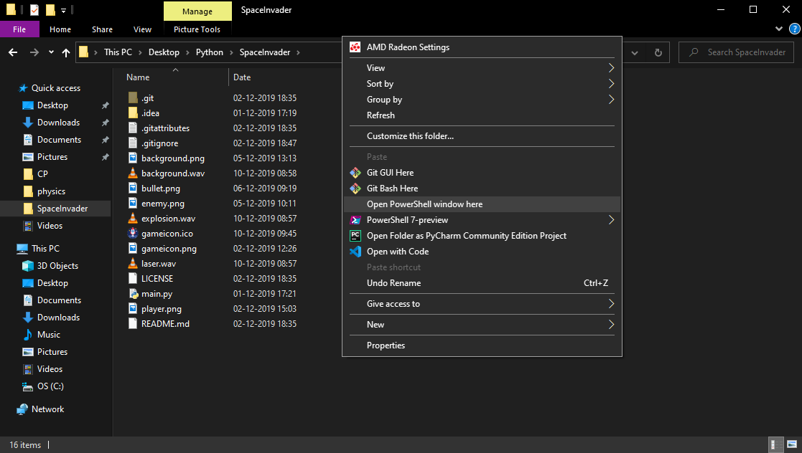

# SpaceInvader

 ## Build Requirements
 * [Python 3.7+](https://www.python.org/downloads/) (Windows) OR `sudo apt-get install python3`
 * Set your [PATH](https://geek-university.com/python/add-python-to-the-windows-path/) properly on Windows (not necessary if `python --version` gives you its version number)
 * pip 
 * [PyGame](https://www.pygame.org/news) (type `pip install pygame` )
 ### How to run?
 #### Method 1
 * Download/clone to any directory you want  
 
 
 * Press Shift+Right click in the directory created and click `Open Powershell Window here`  
 
 
 * type `python main.py`  
 
  
    * _(not giving screenshots of game, see it yourself :P )_
 #### Method 2
 * Download and install [PyCharm community edition](https://www.jetbrains.com/pycharm/download/download-thanks.html?platform=windows&code=PCC)
 * After installing and setting up, click on Open and select the SpaceInvader **folder**  
 
 
 * Then when the project is loaded, click the Green play button(make sure to setup Python properly)  
 
 
 
 
 #### What work can we do on this?
 * Menus maybe?
 * Better graphics?
 * Window size based on host machine resolution and not a constant ancient 800x600? Imagine playing on a 42-inch 4k TV with the game taking up a tiny box in the centre of the screen
 
 Feel free to fork, clone, delete, manipulate, knife, scissor whatever. Cheers to open source! 
 sadn1ck, signing out.
  ## Built using PyCharm Community Edition
   ### With icons and images taken from [flaticon.com](flaticon.com) and Google Images